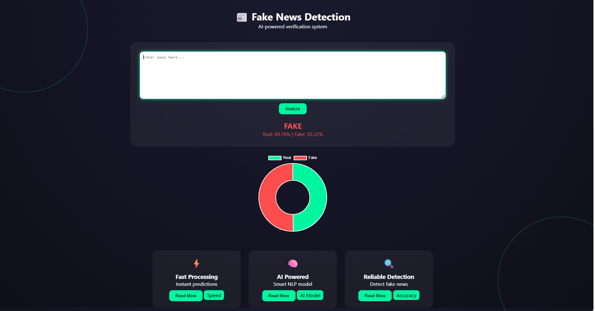
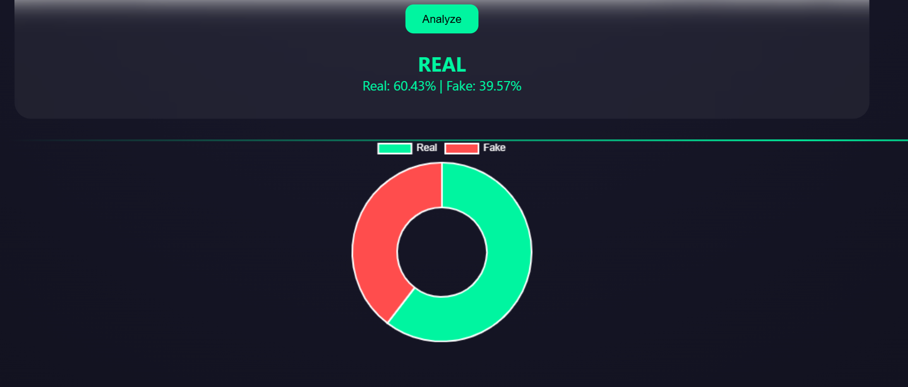

# 📰 Fake News Detection System

A machine learning web app that classifies news as REAL or FAKE using NLP.

## 🚀 Features
- NLP-based text classification
- Flask web app
- Interactive dashboard
- Chart visualization

## 🛠 Tech Stack
- Python
- Flask
- Scikit-learn
- HTML, CSS
- Chart.js
## 📊 Screenshots / Demo

### 🔹 Home Page

### 🔹 Prediction Result

### 🔹 Dataset Visualization

